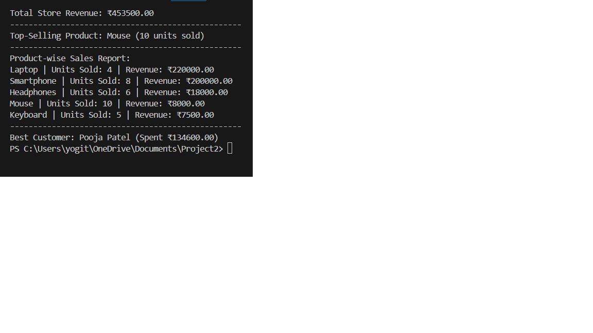

# Online Store Sales Analytics System

An Online Store Sales Analytics System built using **Python** and **MySQL** to analyze sales data, generate business insights, and export reports for further analysis.

This project focuses on backend development, relational database design, and SQL-based analytics.

---

## 🚀 Features

- Manage customers, products, and orders using a relational database
- Perform SQL JOIN operations across multiple tables
- Calculate total store revenue
- Identify top-selling products
- Find the best customer based on total spending
- Generate product-wise sales analytics
- Export sales analytics report to a CSV file

---

## 🛠️ Tech Stack

- **Programming Language:** Python 3
- **Database:** MySQL
- **Libraries:** mysql-connector-python, csv
- **Tools:** VS Code, Git, GitHub

---

## 📂 Project Structure

online-store-sales-analytics/
│── main.py
│── schema.sql
│── README.md
│── sales_report.csv
│── screenshots/


---

## 🗄️ Database Design

### Tables Used

**customers**
- customer_id (Primary Key)
- name
- email

**products**
- product_id (Primary Key)
- product_name
- price

**orders**
- order_id (Primary Key)
- customer_id (Foreign Key)
- product_id (Foreign Key)
- quantity
- order_date

---

## 📊 Analytics Performed

## 📸 Screenshots

### 🔹 Sales Analytics Output (Python)


### 🔹 CSV Sales Report


- Total store revenue calculation
- Top-selling product identification
- Product-wise total quantity sold
- Product-wise revenue analysis
- Best customer based on total purchase amount

---

## 📁 CSV Report

The system generates a CSV file named **`sales_report.csv`** containing:
- Product Name
- Total Quantity Sold
- Total Revenue

This file can be opened in **Excel** or **Google Sheets** for further analysis.

---

## ⚙️ How to Run the Project

### 1️⃣ Create Database and Tables
Run the SQL file:
```sql
SOURCE schema.sql;


